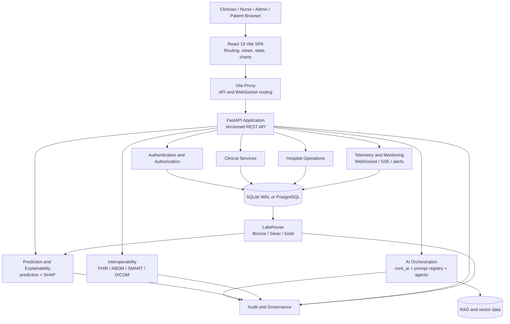
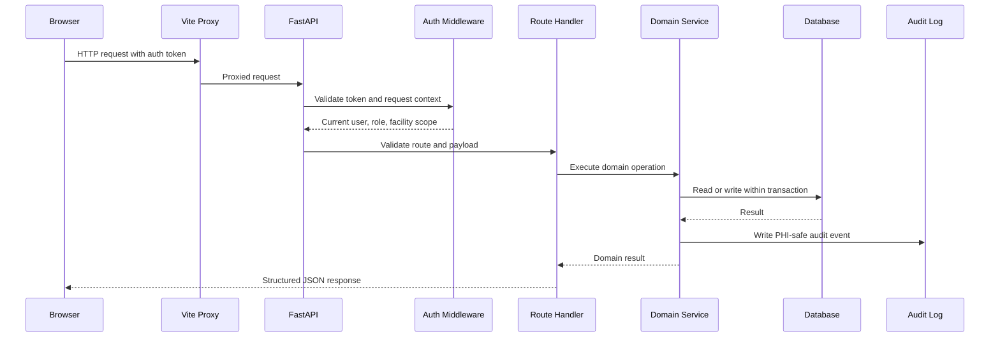
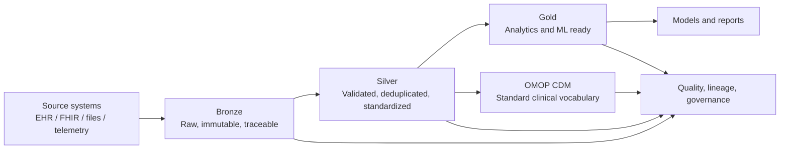

# Compunnel Clinical Intelligence
## Full System Architecture, Functional Specification, and Operations Guide

> **Document status:** Engineering reference
>
> **Primary active runtime:** FastAPI backend + React/Vite frontend
>
> **Alternative deployment path:** Bun/Elysia edge gateway + Rust/Axum gateway
>
> **Clinical safety notice:** This platform is a clinical software system and decision-support aid. AI output and risk scores must be reviewed by a qualified clinician. The platform must not be used as a substitute for diagnosis, treatment, emergency assessment, or professional medical judgment.

---

## 1. Purpose and Scope

Compunnel Clinical Intelligence is a privacy-focused healthcare platform that combines electronic medical record workflows, clinical decision support, artificial intelligence, hospital operations, interoperability, real-time monitoring, and data governance.

The system is designed for:

- Clinicians reviewing patient records and risk indicators.
- Nurses monitoring tasks, observations, and telemetry.
- Hospital administrators managing capacity and operational workflows.
- Billing and pharmacy teams managing their respective records.
- Data and platform teams operating lakehouse, lineage, and governance workflows.
- Researchers and engineers validating models, integrations, and deployment behavior.

This document explains:

1. The system boundaries and runtime modes.
2. The responsibility of every major layer.
3. How requests, data, AI operations, and real-time events move through the system.
4. How authentication, authorization, auditing, and safety controls work.
5. How the main clinical and hospital workflows function.
6. How to run, test, monitor, and deploy the platform.
7. Known implementation challenges and the corresponding solutions.

This document is an implementation guide, not a regulatory certification. HIPAA, GDPR, ABDM, or other compliance claims require a formal organizational, legal, security, and operational assessment.

---

## 2. Architecture Status and Runtime Truth

The repository contains two architectural tracks. They must be kept distinct when developing, testing, or explaining the system.

### 2.1 Active local development runtime

The standard local runtime is:

```text
React 19 + Vite SPA
        |
        | HTTP requests through Vite proxy
        v
FastAPI + Uvicorn backend
        |
        +--> SQLAlchemy database layer
        +--> Clinical and hospital services
        +--> AI provider abstraction
        +--> ML prediction and explainability
        +--> Interoperability adapters
```

Typical development endpoints:

| Component | Default address | Responsibility |
|---|---|---|
| Frontend | `http://127.0.0.1:3000` | Browser application and clinician UI |
| FastAPI backend | `http://127.0.0.1:8000` or configured port | REST API, auth, persistence, AI, clinical services |
| Health check | `/healthz` | Service and dependency readiness |
| API namespace | `/v1/...` | Versioned application API |

The backend port may be changed by the development launcher. The frontend should use the Vite proxy and relative API paths so that changing the backend port does not require changing every frontend request.

### 2.2 Alternative high-performance deployment path

The repository also contains a designed Rust/Bun architecture:

```text
React 19 static assets and browser client
                 |
                 v
Bun + Elysia edge gateway
                 |
                 v
Rust + Axum clinical gateway
                 |
       +---------+----------+
       v                    v
SQLite/PostgreSQL       ONNX inference
```

This track is intended for high-throughput containerized deployment. It is not automatically the active local runtime merely because its source code and Docker configuration exist. Always confirm the running process and launcher before reporting which backend is active.

### 2.3 Runtime selection rule

Use the following order when diagnosing a deployment:

1. Inspect `run_servers.py`, `start_dev.ps1`, Docker Compose files, or the deployment manifest being used.
2. Inspect the actual process command line.
3. Check `/healthz` on the selected port.
4. Run a versioned API request against the same origin used by the frontend.
5. Only then describe the runtime as FastAPI, Rust, or a gateway combination.

---

## 3. High-Level System Architecture



### 3.1 Layer responsibilities

| Layer | Main implementation | Responsibility |
|---|---|---|
| Presentation | `frontend/` | User interaction, route rendering, forms, charts, workflow states |
| API client | `frontend/src/lib/` | Request construction, auth headers, caching, error and session handling |
| API boundary | `backend/main.py` and route modules | Routing, dependency injection, request validation, response serialization |
| Identity | Auth modules and session store | Login, JWT handling, roles, session expiry, access checks |
| Domain services | Backend clinical and operational modules | Clinical records, workflows, billing, pharmacy, monitoring, discharge |
| AI layer | `backend/core_ai.py`, `prompt_registry.py`, agents | Provider abstraction, prompts, RAG context, chat and summaries |
| ML layer | `backend/prediction.py`, explainability modules | Model loading, prediction, risk calculation, explanations |
| Interoperability | FHIR, ABDM, SMART, DICOM modules | Standards-based exchange and imaging integration |
| Persistence | SQLAlchemy models, schemas, database session | Transactions, queries, validation, migration/startup support |
| Data platform | `data/`, `databricks_notebooks/`, Airflow | Ingestion, quality, lineage, OMOP mapping, analytics |
| Operations | `monitoring/`, `k8s/`, `terraform/`, Docker | Metrics, deployment, scaling, alerting, recovery |

---

## 4. Repository Organization

```text
backend/                  FastAPI API, domain services, AI, ML, database, integrations
frontend/                 React 19 and TypeScript single-page application
rust_gateway/             Rust/Axum alternative gateway and native inference path
edge_gateway/             Bun/Elysia edge and proxy layer
android/                  Kotlin Jetpack Compose mobile application
packages/                 Shared Python packages and reusable platform libraries
data/                     Local datasets, lakehouse storage, and development data
databricks_notebooks/     Bronze/Silver/Gold and OMOP data workflows
airflow/                  Scheduled ingestion, quality, and model workflows
models/                   Model artifacts and vector-store resources
e2e_tests/                Opaque-box HTTP and workflow validation
tests/                    Backend unit and integration tests
frontend/tests/           Frontend Playwright tests
k8s/                      Kubernetes resources and scaling configuration
terraform/                Infrastructure-as-code configuration
docs/                     Technical references, runbooks, and architecture records
scripts/                  Development, context, database, and verification utilities
```

### 4.1 Backend ownership map

| Area | Key modules | Function |
|---|---|---|
| Application entry | `backend/main.py` | Creates the application, mounts routes, middleware, startup checks, CORS |
| Database | `backend/database.py`, `backend/models/` | Engine, sessions, persistence models, transaction boundaries |
| Validation | `backend/schemas/` | Pydantic request and response contracts |
| Authentication | `backend/auth.py` and related modules | Password handling, JWT, role checks, session rules |
| AI provider access | `backend/core_ai.py` | Single provider-backed AI entry point |
| Prompt management | `backend/prompt_registry.py` | Named prompts and controlled prompt retrieval |
| Agent orchestration | `backend/agent.py`, `backend/agents/` | Supervisor routing and specialized agent execution |
| Context and retrieval | `backend/chat_context.py`, `backend/rag.py` | Retrieval context, document lookup, response grounding |
| Predictions | `backend/prediction.py` | Model initialization and disease-risk inference |
| Explainability | `backend/explainability.py` and related modules | Feature attribution and explanation payloads |
| Clinical workflows | assessments, care plans, notes, diagnostics, monitoring | Clinical observations and care processes |
| Hospital operations | appointments, admissions, beds, nursing, pharmacy, billing, discharge | Operational records and task workflows |
| Interoperability | FHIR, ABDM, SMART, DICOM modules | External standards and system exchange |
| Governance | audit, consent, compliance, retention, data quality | Traceability, safety, access, retention, quality |

### 4.2 Frontend ownership map

| Area | Location | Function |
|---|---|---|
| Entry and router | `frontend/src/App.tsx` | Application shell and lazy route registration |
| Pages | `frontend/src/pages/` | Dashboard, patient, operations, AI, monitoring, and administrative screens |
| Shared layout | `frontend/src/components/layout/` | Sidebar, navigation, headers, route shells |
| Clinical components | `frontend/src/components/clinical/` | Patient and care-related views |
| Operations components | `frontend/src/components/operations/` | Telemetry, PACS, beds, pharmacy, and hospital operations |
| Modals | `frontend/src/components/modals/` | Upload, edit, confirmation, and workflow dialogs |
| API utilities | `frontend/src/lib/api.ts`, `apiCore.ts` | HTTP requests, caching, auth, errors, API URL handling |
| Auth state | Zustand store and auth helpers | Login state, token storage, session expiration |
| Tests | `frontend/src/__tests__/`, `frontend/tests/` | Unit, component, and browser workflow verification |

---

## 5. Frontend Architecture and Functioning

### 5.1 Application startup

1. Vite starts the development or production asset server.
2. The React entry point mounts the application root.
3. The router determines the current page.
4. Protected routes verify the local auth state before rendering clinical content.
5. API helpers obtain the configured API base URL or use relative paths through the Vite proxy.
6. The application displays connection state based on health checks and request failures.

### 5.2 Navigation and page composition

The interface is organized around repeated clinical and operational workflows:

- Dashboard and clinical overview.
- Patient registry and patient detail.
- EMR, assessments, care plans, notes, and clinical history.
- Clinical AI and risk prediction.
- Telemedicine and appointment workflows.
- Real-time telemetry and ECG monitoring.
- PACS/DICOM imaging review and upload.
- Hospital capacity, beds, admissions, nursing, pharmacy, billing, and discharge.
- Data, governance, administration, audit, and profile controls.

Pages should remain thin. API access belongs in shared client utilities, while reusable display and interaction behavior belongs in components or hooks.

### 5.3 API request behavior

The frontend request path should follow this pattern:

```text
Page or component
      |
      v
Shared API helper
      |
      +--> Attach JWT when available
      +--> Use relative /v1 path or VITE_PUBLIC_API_URL
      +--> Handle JSON and stream responses
      +--> Normalize connection failures
      +--> Emit session-expired event for unauthorized responses
      v
Backend endpoint
```

Rules:

- Do not construct backend URLs in individual pages.
- Use `VITE_PUBLIC_API_URL` when a direct backend origin is required.
- Prefer relative `/v1/...` requests when Vite proxying is enabled.
- Treat `401` as a session problem and clear the auth state.
- Treat connection failures separately from authentication failures.
- Never display raw server stack traces or sensitive API responses to users.

### 5.4 Real-time telemetry behavior

1. The user opens a monitoring view.
2. The frontend checks the patient and telemetry permissions.
3. A WebSocket or polling connection is established through the configured API boundary.
4. Incoming observations are validated before rendering.
5. The UI updates vital cards, ECG/waveform visualizations, and alert states.
6. Threshold violations become monitoring signals.
7. The connection shows degraded, reconnecting, or healthy state without blocking unrelated pages.
8. The user can acknowledge or resolve alerts according to permissions.

The monitoring interface must distinguish:

- No data received.
- Backend unavailable.
- Authentication expired.
- Patient has no active telemetry.
- Telemetry is active but outside expected thresholds.

### 5.5 PACS and DICOM behavior

The imaging workflow consists of:

1. Selecting a DICOM or supported image input.
2. Validating file type and size on the client.
3. Uploading through the DICOM endpoint.
4. Persisting the imaging record before optional audit enrichment.
5. Displaying the image or a controlled fallback representation when a demo asset is unavailable.
6. Providing viewing tools such as pan, zoom, reset, and download where supported.
7. Showing metadata outside the image canvas so it does not obscure the scan.
8. Recording the access and upload event in a PHI-safe audit trail.

The viewer must not imply diagnostic certainty. A qualified radiologist or clinician remains responsible for interpretation.

---

## 6. Backend Architecture and Functioning

### 6.1 Request lifecycle



### 6.2 Database session rules

- Route handlers obtain sessions through `backend.database.get_db` and dependency injection.
- Route handlers do not instantiate `SessionLocal()` directly.
- Reads are scoped to the authenticated user, facility, or authorized relationship.
- Writes use transactions and rollback on failure.
- Schema changes update models, Pydantic schemas, and migration/startup behavior together.
- Tests use isolated temporary or in-memory databases and must not modify the development database.
- Production database location is read from `DATABASE_URL`.

### 6.3 Domain operation pattern

A domain operation should follow:

```text
Request schema
   -> authorization and consent check
   -> domain validation
   -> database transaction
   -> external integration, if required
   -> audit event
   -> response schema
```

External calls should use timeouts, safe error handling, retry or circuit-breaker behavior where appropriate, and should never expose credentials or patient information in logs.

---

## 7. Clinical and Hospital Workflows

### 7.1 Patient and EMR workflow

1. A user searches for a patient within their permitted facility and role scope.
2. The backend returns only fields allowed by the user's permissions.
3. The patient detail page loads demographics, encounters, observations, medications, notes, care plans, diagnostics, risk assessments, and recent activity.
4. Each tab or panel requests only the data required for that view.
5. Changes are validated, persisted transactionally, and audited.
6. The UI refreshes affected data and presents a clear success or failure state.

### 7.2 Risk prediction workflow

```text
Validated patient features
        |
        v
Prediction input schema
        |
        v
Model registry and initialized model
        |
        v
Prediction and probability
        |
        v
Risk level and confidence checks
        |
        v
Explainability output
        |
        v
Clinician-facing result with disclaimer
```

Required behavior:

- Models are loaded and owned by `prediction.py`.
- Inputs are validated and normalized using the model's expected feature contract.
- A prediction must include probability or confidence where available.
- Explanation output should identify contributing features without presenting causation as certainty.
- Low-confidence results should be marked as uncertain or withheld according to the configured safety policy.
- The response must include a medical disclaimer and recommend qualified clinician review.
- Model version, input contract, timestamp, and audit context should be available for traceability.

### 7.3 AI clinical assistant workflow

1. The user submits a question, summary request, or workflow action.
2. Authorization and patient context are verified.
3. Relevant records are selected according to access and consent rules.
4. Retrieval context is assembled by the RAG layer where applicable.
5. The named prompt is loaded from `prompt_registry.py`.
6. The request is sent through `core_ai.py`.
7. The result is checked for safety, unsupported certainty, and required disclaimer text.
8. The response is streamed or returned to the frontend.
9. The request outcome is logged without exposing sensitive clinical text.

AI output must be treated as assistance. It must not independently diagnose, prescribe, change medication, or initiate an emergency action without an authorized human workflow.

### 7.4 Appointment and telemedicine workflow

- Search availability within authorized facilities and specialties.
- Validate patient, provider, time, and appointment status.
- Prevent conflicting bookings using transaction protection.
- Store the appointment and emit an audit event.
- Display provider names using one consistent title formatter to avoid duplicate titles.
- Provide a clear state for scheduled, confirmed, cancelled, completed, and no-show appointments.

### 7.5 Beds, admissions, nursing, and discharge

| Workflow | Functional behavior |
|---|---|
| Beds | Show facility, ward, room, occupancy, cleaning, maintenance, and availability states |
| Admissions | Create encounter, assign facility and bed, capture admission reason, and audit status changes |
| Nursing | Create prioritized tasks, assign staff, track due time, completion, and escalation |
| Discharge | Validate discharge readiness, generate instructions, reconcile medications, and close encounter |
| Care events | Record observations, actions, transitions, and clinically relevant events |

These workflows should be implemented as explicit state transitions rather than free-form status strings wherever possible.

### 7.6 Pharmacy and billing

Pharmacy functionality includes medication catalog, inventory, prescriptions, dispense records, interaction checks, and stock movement. Billing functionality includes billable services, invoices, line items, payments, claims, and audit history.

Critical transaction requirements:

- Inventory dispensing must not produce negative stock without an explicit exception policy.
- Payment and invoice updates must be atomic.
- Prescription and dispense actions require role authorization.
- Billing information must be separated from clinical display where the user's role does not permit access.
- Failed external claims calls must be retryable and must not create duplicate charges.

---

## 8. AI, ML, and Explainability Architecture

### 8.1 Provider abstraction

All provider-backed LLM, embedding, or vision inference must pass through `backend/core_ai.py`.

```text
Application feature
      |
      v
core_ai.generate / chat / chat_stream / embed_text
      |
      +--> local provider such as Ollama
      +--> configured external provider
      +--> deterministic development fallback
      v
Normalized response and safety handling
```

Benefits:

- One place for provider configuration and timeouts.
- Consistent fallback behavior.
- Centralized redaction and error handling.
- Easier mocking in tests.
- Reduced provider lock-in.

### 8.2 Prompt registry

Prompts are named and retrieved from `prompt_registry.py`.

This provides:

- Versionable prompt definitions.
- Consistent system instructions.
- Safer review of clinical behavior changes.
- Testable prompt selection.
- A clear separation between route code and model instructions.

System prompts must not be inlined in route handlers.

### 8.3 Agent orchestration

The supervisor or agent layer routes a request to a specialized capability such as clinical summary, retrieval, risk explanation, operations support, or governance assistance.

A typical execution is:

```text
User request
   -> intent and permission evaluation
   -> supervisor route selection
   -> context retrieval
   -> specialized agent/tool
   -> safety and formatting pass
   -> response with disclaimer where clinical advice is involved
```

Agent tools must have explicit input schemas and permission boundaries. The agent must not gain broader database access merely because a user asks for it in natural language.

### 8.4 Prediction and explainability

The prediction subsystem owns model initialization and prediction execution. The explainability subsystem produces feature-level attribution or reason codes where supported.

A production model record should include:

- Model name and version.
- Training data reference.
- Feature schema and preprocessing version.
- Calibration information.
- Evaluation metrics.
- Known limitations.
- Approval status.
- Deployment timestamp.
- Rollback version.

Model results should be monitored for:

- Missing or invalid input rates.
- Distribution drift.
- Confidence changes.
- Class imbalance effects.
- Latency and timeout rates.
- Clinician override or correction patterns.
- Differences between training and production outcomes.

---

## 9. Data Architecture

### 9.1 Operational data

The operational database stores users, facilities, appointments, encounters, observations, orders, medications, billing records, audit records, and other application entities.

The active Python runtime uses SQLAlchemy and supports a local SQLite development path. PostgreSQL is the preferred production-class relational option when configured.

### 9.2 Lakehouse medallion architecture



#### Bronze

- Preserve source records with ingestion metadata.
- Store source identity, ingestion timestamp, and batch identifier.
- Avoid destructive transformations.
- Support replay and investigation.

#### Silver

- Validate schemas and required fields.
- Normalize timestamps and codes.
- Deduplicate records.
- Resolve terminology and identity mappings.
- Reject or quarantine invalid records with reason codes.

#### Gold

- Publish trusted aggregates and feature tables.
- Support dashboards, model training, quality analysis, and operational reporting.
- Apply documented business definitions.
- Maintain lineage back to Silver and Bronze sources.

### 9.3 OMOP and interoperability

OMOP CDM provides a standardized analytical representation. FHIR R4 provides exchange-oriented resources and bundles. These serve different purposes:

- FHIR is used for exchange, APIs, and external system integration.
- OMOP is used for normalized analytics, cohort construction, and research.
- Internal operational models remain optimized for application transactions.

Transformation processes must preserve source identifiers and mapping provenance.

### 9.4 Data quality controls

Recommended quality checks include:

- Schema and type validation.
- Required-field checks.
- Referential integrity.
- Date and time consistency.
- Duplicate detection.
- Range and unit checks for vitals.
- Terminology mapping completeness.
- Patient and facility identity reconciliation.
- PII and secret scanning.
- Lineage completeness.

Invalid data should be quarantined with a machine-readable reason instead of silently discarded.

---

## 10. Interoperability and Imaging

### 10.1 FHIR R4

FHIR adapters translate internal records into resources such as Patient, Encounter, Observation, MedicationRequest, DiagnosticReport, CarePlan, and AuditEvent.

Every export should define:

- Resource profile.
- Required fields.
- Identifier strategy.
- Code-system mappings.
- Consent and authorization requirements.
- Error response behavior.
- Provenance and audit behavior.

### 10.2 ABDM and ABHA

The ABDM integration should be isolated behind a service adapter and configuration boundary. It must support local mock or sandbox behavior so development and tests do not require production credentials.

Required controls:

- Secrets only from environment configuration.
- Explicit consent state.
- Request correlation identifiers.
- Timeout and retry handling.
- No sensitive response content in logs.
- Audit of consent and exchange events.

### 10.3 SMART on FHIR

SMART launch flow responsibilities include client registration, redirect validation, token handling, scope enforcement, and FHIR resource access. Tokens must be stored and transmitted securely, and the requested scopes must be minimized.

### 10.4 DICOM and PACS

DICOM integration should preserve study, series, instance, and patient-reference relationships. Viewer metadata must be separated from the image canvas. Upload and retrieval actions must be authorized and audited.

---

## 11. Security, Privacy, and AI Safety

### 11.1 Identity and authorization

- Authenticate users with signed tokens and controlled expiration.
- Enforce role-based permissions at the backend, not only in the UI.
- Scope patient records to the authenticated identity, facility, clinician relationship, and consent state.
- Deny by default when a permission or consent relationship is missing.
- Revoke or expire sessions when a token is invalid or expired.

### 11.2 PII and PHI handling

- Do not log patient names, dates of birth, diagnoses, notes, or raw chat content.
- Do not include real patient data in tests, fixtures, screenshots, examples, or documentation.
- Use identifiers or redacted references in logs.
- Encrypt sensitive data at rest and in transit in production.
- Use environment variables or a secret manager for keys and credentials.
- Do not commit credentials, tokens, or database URLs containing passwords.

### 11.3 Audit trail

Audit events should capture:

- Actor identifier.
- Action category.
- Resource type and non-sensitive reference.
- Outcome status.
- Timestamp.
- Correlation/request identifier.
- Facility or tenant context where applicable.

Audit entries should not duplicate the clinical payload. Audit failures should be handled according to the risk policy, with critical actions failing closed where required.

### 11.4 AI safety controls

- Show a medical disclaimer for patient-facing AI and prediction features.
- Require clinician review for diagnosis, treatment, emergency, or medication decisions.
- Distinguish generated summaries from source records.
- Display uncertainty and confidence limitations.
- Prevent prompt injection from bypassing authorization.
- Keep external providers behind the central AI abstraction.
- Record model and prompt versions for reproducibility.
- Provide a user-visible correction or feedback path.

### 11.5 Session and connection safety

The frontend should distinguish:

| Condition | User-facing behavior |
|---|---|
| Backend unavailable | Show connection degraded state and retry option |
| Token expired | Clear session and redirect to login |
| Permission denied | Show an access message without revealing resource existence unnecessarily |
| Validation error | Show field or request-specific guidance |
| Server error | Show a generic safe error and retain a correlation ID if available |
| Stream disconnected | Reconnect with bounded backoff and show stream status |

---

## 12. Deployment Architecture

### 12.1 Local development

Recommended sequence:

```powershell
# Backend
.\.venv\Scripts\python.exe -m uvicorn backend.main:app --host 127.0.0.1 --port 8000

# Frontend
Set-Location frontend
bun run dev
```

The frontend is expected at `http://127.0.0.1:3000`.

The combined development launcher may start both services and select a backend port. When the backend port changes, the launcher must pass the selected origin to the frontend through `VITE_PUBLIC_API_URL` or configure the Vite proxy accordingly.

### 12.2 Docker Compose

Docker Compose configurations are available for local, production, enterprise, and microservice-oriented deployments. Before starting a stack:

1. Check which services are enabled.
2. Check port mappings.
3. Confirm database and secret configuration.
4. Confirm whether the stack uses FastAPI or Rust/Bun.
5. Verify health checks after startup.

### 12.3 Kubernetes and cloud

The Kubernetes and Terraform layers provide a path to:

- Separate API, telemetry, data, and worker workloads.
- Scale stateless API replicas horizontally.
- Scale telemetry consumers based on connection or message load.
- Keep persistent data in managed database and object storage services.
- Store secrets in a managed secret system.
- Use rolling deployments with readiness and liveness probes.
- Preserve audit and monitoring data independently from application pods.

### 12.4 Reliability model

Production deployments should provide:

- Readiness and liveness checks.
- Structured metrics and logs.
- Timeout and retry policies.
- Circuit breakers for optional dependencies.
- Database backups and restore tests.
- Migration rollback or forward-fix procedures.
- Model rollback procedures.
- Static asset versioning.
- Incident and security response runbooks.

---

## 13. Configuration Reference

Configuration must be environment-specific and must not contain committed secrets.

| Variable or setting | Purpose |
|---|---|
| `DATABASE_URL` | Operational database location |
| `VITE_PUBLIC_API_URL` | Frontend API origin when direct API access is required |
| `JWT_SECRET` | Token signing secret; required from secure configuration in production |
| `PHI_ENCRYPTION_KEY` | Encryption key for protected fields where enabled |
| AI provider variables | Provider selection, endpoint, and credentials through `core_ai.py` |
| ABDM/FHIR variables | Sandbox or production interoperability endpoints and credentials |
| Model paths | Locations of model artifacts and scaler resources |
| CORS configuration | Allowed browser origins for each environment |
| Telemetry configuration | Stream intervals, limits, and retention behavior |

Safe defaults should support local development without external API keys, while production must fail safely when required security configuration is missing.

---

## 14. Testing and Verification

### 14.1 Backend tests

Run the backend suite with parallelization:

```powershell
python -m pytest tests/ -n auto -v
```

Focused checks can be used during development:

```powershell
python -m pytest tests/ -n auto -v -k "auth or prediction or chat"
```

Backend tests should cover:

- Authentication and token expiry.
- Role and facility authorization.
- Patient isolation.
- Database transactions and rollback.
- Prediction schemas and safety thresholds.
- AI provider mocking and fallback behavior.
- FHIR and ABDM serialization.
- DICOM upload and metadata handling.
- Audit and privacy behavior.
- Health and readiness endpoints.

### 14.2 Frontend checks

From the `frontend/` directory:

```powershell
bun run lint
bun test
bun run build
```

Frontend tests should cover:

- Route access and navigation.
- Auth state and expired sessions.
- API error and degraded connection states.
- Prediction disclaimer and confidence display.
- Telemetry and reconnect states.
- DICOM upload interactions.
- Responsive layouts and dynamic panel sizing.
- Hospital operation state changes.

### 14.3 End-to-end tests

Opaque-box HTTP and browser tests should validate real behavior through the running application:

- Login and session lifecycle.
- Patient search and record isolation.
- Prediction request and explanation response.
- AI assistant response and disclaimer.
- Appointment booking.
- Bed and admission workflows.
- Pharmacy and billing transactions.
- Telemetry connection behavior.
- DICOM upload and retrieval.
- FHIR and governance endpoints.

Tests must use synthetic data and mock external AI or interoperability providers.

### 14.4 Verification gates

Before reporting a feature as complete:

1. Run the narrowest relevant test.
2. Run type checking or linting for changed frontend code.
3. Run backend tests for changed API or service code.
4. Verify the health endpoint.
5. Verify the user-facing workflow in the browser where applicable.
6. Check logs for secrets or PII.
7. Confirm that unrelated files and user changes were not altered.

---

## 15. Observability and Operations

### 15.1 Health checks

Health checks should distinguish:

- Application process availability.
- Database connectivity.
- Model availability.
- AI provider availability or local fallback readiness.
- External interoperability readiness.
- Queue or stream readiness.

A healthy application process does not necessarily mean every optional dependency is available.

### 15.2 Metrics

Recommended metrics include:

- HTTP request count, latency, and error rate.
- Authentication failure rate.
- Database query latency and transaction failures.
- Prediction latency, errors, and confidence distribution.
- AI request latency, provider failures, and fallback usage.
- Telemetry connection count and dropped messages.
- Queue depth and worker failures.
- Data-quality rejection counts.
- Audit write failures.
- Model drift and feature distribution changes.

### 15.3 Logging

Use structured logs with:

- Timestamp.
- Severity.
- Service and module.
- Request/correlation ID.
- Route or operation name.
- Status and duration.
- Non-sensitive actor or resource reference.

Never log raw authorization headers, passwords, API keys, patient names, DOBs, clinical notes, or full AI prompts containing patient data.

---

## 16. Main Challenges and Solutions

### Challenge 1: Backend connection changes when the port changes

**Cause:** Frontend requests point to a stale hardcoded backend port, or the Vite proxy is not updated when the launcher selects a different port.

**Solution:** Use relative `/v1` paths through Vite proxying, configure the proxy from `VITE_PUBLIC_API_URL`, and have the launcher pass the selected backend origin to the frontend. Verify the final frontend request and `/healthz` endpoint after startup.

### Challenge 2: Port conflicts during local startup

**Cause:** Docker, WSL, or stale development processes may already listen on a port.

**Solution:** Check the exact local address and process before stopping anything. Remove only confirmed stale application processes. Do not stop shared Docker or WSL services without explicit confirmation. Use strict port behavior when a fixed port is required.

### Challenge 3: AI output can be uncertain or unsafe

**Cause:** Generated text and model predictions may be incomplete, overconfident, or based on insufficient context.

**Solution:** Centralize AI calls, use named prompts, validate context and permissions, expose confidence and limitations, include medical disclaimers, require clinician review, and monitor corrections and safety events.

### Challenge 4: Clinical data is sensitive

**Cause:** Logs, tests, screenshots, error messages, and analytics can unintentionally expose PHI.

**Solution:** Use synthetic data, redact logs, scope every query, encrypt sensitive fields, audit access, scan for secrets, and prevent raw payloads from entering telemetry or error messages.

### Challenge 5: Multiple healthcare standards have different purposes

**Cause:** FHIR, OMOP, DICOM, and internal EMR models cannot be treated as interchangeable schemas.

**Solution:** Maintain explicit adapters and provenance. Use internal transactional models for workflows, FHIR for exchange, OMOP for analytics, and DICOM structures for imaging.

### Challenge 6: Real-time telemetry can degrade independently of the application

**Cause:** Network interruptions, stream backpressure, device availability, or browser rendering limits can interrupt monitoring.

**Solution:** Add bounded reconnect logic, connection states, data timestamps, message validation, alert persistence, server-side health checks, and clear distinction between missing data and abnormal data.

### Challenge 7: Rust/Bun and FastAPI documentation can diverge

**Cause:** The repository contains an implemented alternative architecture while local scripts may still launch FastAPI.

**Solution:** Label active and planned paths explicitly, verify the process at runtime, keep interface contracts synchronized, and test both deployment modes separately.

### Challenge 8: Model performance can change after deployment

**Cause:** Population, data collection, coding, or device behavior can drift from training conditions.

**Solution:** Track model versions, feature distributions, calibration, outcome feedback, drift metrics, review thresholds, and rollback artifacts.

### Challenge 9: Hospital workflows cross domain boundaries

**Cause:** Admissions, beds, nursing, pharmacy, billing, and discharge affect one another.

**Solution:** Use explicit state transitions, transactional updates, stable identifiers, event/audit records, idempotency keys, and end-to-end workflow tests.

### Challenge 10: Local development should not depend on paid providers

**Cause:** External provider keys and sandbox availability are unreliable for contributors and automated tests.

**Solution:** Provide local mocks, deterministic fallbacks, isolated test fixtures, configurable provider adapters, and clear production-only configuration requirements.

---

## 17. Recommended Delivery Sequence

For ongoing implementation, use the following order:

1. Stabilize authentication, database isolation, CORS, and health checks.
2. Complete the clinical dashboard and patient EMR workflows.
3. Validate risk prediction and explainability with synthetic clinical datasets and clinician review.
4. Validate telemetry and ECG streaming under reconnect and degraded-network conditions.
5. Complete the AI clinical assistant with prompt governance and safety review.
6. Finish hospital operations state transitions and cross-workflow tests.
7. Harden lakehouse, OMOP, data quality, lineage, and governance workflows.
8. Expand access control, audit, consent, retention, and AI safety controls.
9. Establish model monitoring, deployment gates, rollback, and incident response.
10. Validate the Rust/Bun deployment path against the same API and workflow contracts before changing the default runtime.

---

## 18. Definition of Done

A feature is ready for release when:

- The backend route, schema, authorization, and transaction behavior are implemented.
- The frontend workflow handles loading, success, validation, permission, empty, degraded, and error states.
- Patient data is scoped and no sensitive data is exposed in logs or tests.
- AI output includes the required clinical disclaimer and human-review guidance.
- Audit behavior is defined and tested.
- Relevant unit, integration, and end-to-end tests pass.
- Health and readiness checks report the correct dependency state.
- Documentation names the active runtime and configuration requirements.
- Deployment and rollback behavior are understood.
- The change has been checked for regressions in adjacent workflows.

---

## 19. Quick Reference

### Start the active local stack

```powershell
# Backend
.\.venv\Scripts\python.exe -m uvicorn backend.main:app --host 127.0.0.1 --port 8000

# Frontend
Set-Location frontend
bun run dev
```

### Check service health

```powershell
Invoke-WebRequest http://127.0.0.1:8000/healthz
```

### Run verification

```powershell
python -m pytest tests/ -n auto -v
Set-Location frontend
bun test
bun run build
```

### Important ownership rules

- Provider-backed AI calls go through `backend/core_ai.py`.
- Prompts come from `backend/prompt_registry.py`.
- Model loading belongs to `backend/prediction.py`.
- Route database sessions come from `backend.database.get_db`.
- Database configuration comes from `DATABASE_URL`.
- Frontend API calls belong in shared API helpers.
- Tests use synthetic data and isolated databases.
- Medical AI output requires clinician review and a disclaimer.

---

## 20. Related Documentation

- [Repository rules](../AGENTS.md)
- [Backend rules](../backend/AGENTS.md)
- [Frontend rules](../frontend/AGENTS.md)
- [Project architecture vision](../PROJECT.md)
- [UI design system](../DESIGN.md)
- [Master architecture runbook](AI_Healthcare_System_Master_Architecture_Runbook.md)
- [Architecture decisions](architecture-decisions.md)
- [Data engineering master guide](DATA_ENGINEERING_MASTER_GUIDE.md)
- [AI agent architecture](AI_AGENT_ARCHITECTURE.md)
