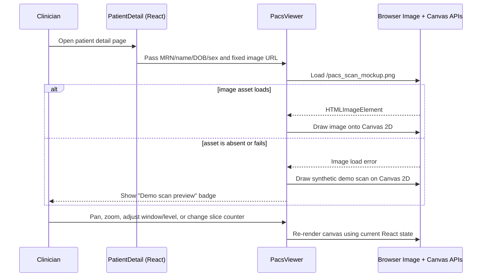

# PACS and DICOM Image Workflow

## Purpose

This guide describes the PACS Study Viewer shown on the patient page: its user interface, current implementation, technologies, request flow, backend persistence, and the difference between image review and automated diagnosis.

The most important current-state fact is that this screen is a **PACS-style review prototype and DICOM study metadata workflow**. In its current patient-page integration, it does not receive uploaded DICOM pixel data, reconstruct a real volume, or return an automated radiology diagnosis. The clinician remains responsible for image interpretation.

This document records what the code currently does. Labels in the UI such as "PACS Cloud Sync", "C-STORE", "3D Raycasting", and "ONLINE" should not be interpreted as proof that a remote PACS archive or real reconstruction engine is connected.

## At a Glance

| Concern | Current implementation |
|---|---|
| UI framework | React + TypeScript |
| Canvas rendering | Browser Canvas 2D API |
| UI styling | Tailwind utility classes and project CSS variables |
| Viewer controls/icons | React state and Lucide icons |
| Upload modal animation | Framer Motion |
| Frontend API calls | Shared `apiFetch` from `frontend/src/lib/apiCore.ts` |
| API server | FastAPI |
| Persistence | SQLAlchemy `DicomStudy` model |
| Current upload payload | JSON study metadata; not file bytes |
| Current displayed image | `/pacs_scan_mockup.png`, or generated Canvas fallback |
| Current diagnostic result | None produced by this viewer flow |
| DICOMweb | Readiness, metadata-link, and limited metadata endpoints; not pixel retrieval in this module |

## Component Map

```text
PatientDetail page
  ├── PACS Study Viewer panel
  ├── Upload DICOM button
  │     └── DicomUploadModal
  │           ├── Reads selected file in browser
  │           ├── Checks the optional DICM preamble
  │           ├── Creates a study UID and metadata
  │           └── POST /v1/hospital/dicom/upload (JSON metadata only)
  └── PacsViewer
        ├── Attempts to load /pacs_scan_mockup.png
        ├── Draws the image or a synthetic fallback on Canvas 2D
        ├── Implements viewport controls in React state
        └── Opens the illustrative DicomMprRendererModal

FastAPI
  ├── hospital_operations.upload_dicom_study
  ├── SQLAlchemy DicomStudy table
  ├── audit logging
  └── DICOMweb helpers and metadata endpoints
```

### Main files

- Patient-page integration: `frontend/src/pages/PatientDetail.tsx`
- Main viewer and toolbar: `frontend/src/components/operations/PacsViewer.tsx`
- Upload UI and metadata inspection: `frontend/src/components/modals/DicomUploadModal.tsx`
- MPR modal: `frontend/src/components/modals/DicomMprRendererModal.tsx`
- Additional illustrative MPR widget: `frontend/src/components/dicom/Dicom3dMprViewer.tsx`
- Shared HTTP client: `frontend/src/lib/apiCore.ts`
- FastAPI upload route: `backend/hospital_operations.py`
- Study persistence model: `backend/models/hospital.py`
- DICOMweb helper endpoints: `backend/dicomweb.py`
- Pixel normalization helper: `backend/rust_bridge.py`
- Segmentation placeholder: `backend/ml/dicom_3d_segmentation.py`

## Architecture and Request Paths

### Current patient page and image display



In the current patient page code, `PacsViewer` receives `/pacs_scan_mockup.png`. If the asset does not load, the component draws a synthetic shape. The image preview is not selected from the uploaded study record.

### Current upload path

```mermaid
sequenceDiagram
    participant User as Clinician
    participant Modal as DicomUploadModal (React)
    participant Client as Browser APIs
    participant API as apiFetch
    participant Server as FastAPI
    participant DB as SQLAlchemy Database
    participant Audit as Audit/Event Services

    User->>Modal: Select or drop a file
    Modal->>Client: Read file as ArrayBuffer
    Modal->>Client: Inspect bytes 128-131 for "DICM"
    Modal->>Client: Hash at most first 1024 bytes to generate a UID
    User->>Modal: Choose modality and target vault; submit
    Modal->>Modal: Animate local progress values
    Modal->>API: POST JSON metadata to /v1/hospital/dicom/upload
    API->>Server: Attach auth token and send request
    Server->>DB: Create DicomStudy record
    DB-->>Server: Commit and return study id
    Server->>Audit: Record upload action
    Server-->>Modal: Return status and study UID
    Modal->>Audit: Dispatch best-effort care event
    Modal-->>User: Show success toast
```

**The file bytes are not included in the POST body.** The selected file is read locally for a small header check and UID derivation, then the browser sends JSON fields such as `study_uid`, `modality`, `target_vault`, `file_name`, `file_size_kb`, and `is_preamble_valid`. The current implementation therefore persists a study metadata row, not the image object itself.

## What Happens in Each Part

### 1. Patient page panel

`PatientDetail.tsx` lays out the PACS panel and passes patient display values (MRN, name, DOB, and sex) to `PacsViewer`. It also passes the fixed demo image URL. The panel shows an `ONLINE` badge and a study label in its markup; these labels are not driven by a live archive connectivity check or by the uploaded DICOM metadata in this flow.

The upload modal is opened from the panel button. In the current wiring, the viewer does not request the uploaded study list, and the upload modal does not receive a refresh callback from this call site. Consequently, metadata upload does not replace or refresh the image shown in the canvas.

### 2. File selection and header check

`DicomUploadModal.tsx` accepts `.dcm`, `.ima`, and `.zip` file names in the browser file picker and supports drag and drop. It reads the selected file using `File.arrayBuffer()` and:

1. Checks whether the buffer has at least 132 bytes.
2. Checks for the ASCII characters `DICM` at byte offsets 128 through 131.
3. Computes SHA-256 over up to the first 1024 bytes.
4. Uses part of that digest to create a UID-like string.
5. Stores the filename, rounded file size, preamble result, and generated UID in component state.

This is only a limited preamble check. It does not parse the full DICOM dataset, validate transfer syntax, check all required tags, decompress a ZIP archive, validate pixel data, or establish that the file belongs to the selected patient. A valid DICOM file may also omit the preamble in some valid encodings, so preamble presence alone is not a complete validity test.

### 3. Upload progress and HTTP request

On submit, the modal advances `uploadProgress` through fixed increments with short local delays. This is an animation, not a measurement of bytes uploaded or a response from an archive.

It then calls the shared `apiFetch` helper. That helper:

- Resolves the API base from `VITE_PUBLIC_API_URL` or uses the development `/v1` path.
- Adds the current bearer token when available.
- Sends JSON with `Content-Type: application/json`.
- Handles connection errors and expired sessions centrally.

The backend route is mounted under the `/v1` prefix, making the request path `/v1/hospital/dicom/upload` in the active FastAPI configuration.

### 4. Backend persistence and identity association

`upload_dicom_study` in `backend/hospital_operations.py` creates a `DicomStudy` SQLAlchemy row with:

- `study_uid`
- `patient_id`
- `modality`
- `target_vault`
- `file_name`
- `file_size_kb`
- `is_preamble_valid`
- `created_at`

The model is defined in `backend/models/hospital.py`. The handler currently sets `patient_id` to `current_user.id`. It does not accept a selected patient ID in the posted body, and it does not verify a patient-to-study association from the page's MRN. This is an important integration limitation: in a multi-role clinical workflow, the authenticated user may be a clinician rather than the patient whose page is open. Production behavior should associate the study to the authorized target patient explicitly and validate facility/consent scope server-side.

The route commits the metadata record and then calls the audit logger. The upload modal separately emits a best-effort care event. Review the event payload before production use because the current client-side summary includes patient display information and should be minimized/redacted under the repository's PHI-safe logging policy.

### 5. Canvas display and fallback

`PacsViewer.tsx` uses React hooks (`useState`, `useEffect`, and refs) with the HTML Canvas 2D API.

- The component creates an `Image` and attempts to load the provided `imageUrl`.
- On success, the image is held in a ref and drawn onto the canvas.
- On failure, it marks the image unavailable and draws a generated gradient with ellipse outlines as a demo preview.
- The fallback changes slightly with the slice counter and applies browser canvas filters for brightness, contrast, and inversion.
- The fallback is decorative/synthetic and contains no patient scan data.

The canvas is resized to the current viewport element and re-rendered when viewport state changes. When a real static image loads, brightness and contrast are applied by reading pixel data and mapping intensity into a new grayscale value. The implementation assumes grayscale intensity based on the red channel; this is a display transform, not DICOM modality LUT processing.

### 6. Viewer toolbar and gestures

| Control | Current behavior | Important limitation |
|---|---|---|
| Brightness/contrast (sun icon) | Selects window/level drag mode. Dragging horizontally changes `windowWidth`; dragging vertically changes `windowCenter`. Clicking also toggles between two preset state values. | Uses 8-bit display values and generic canvas math; not full DICOM VOI LUT implementation. |
| Pan (crosshair icon) | Selects pan mode. Dragging moves image. Wheel pans vertically; Shift+wheel pans horizontally. Arrow keys move image by a fixed step. | No volume orientation or pixel-spacing handling. |
| Zoom (magnifier icon) | Selects zoom mode; button click zooms in. Wheel zooms around pointer unless slice scrolling is active. | Drag-zoom has a lower bound but no consistent upper bound across every interaction. |
| Scroll slices (up/down icon) | Changes slice counter by wheel or drag, clamped from 1 to 120. | Does not load a corresponding DICOM frame; the same source image may remain displayed. In fallback mode only the synthetic shape offset changes. |
| Invert (half-circle icon) | Toggles intensity inversion. | A simple display inversion, not a modality-specific diagnostic preset. |
| Reset | Fits the current image/fallback to the viewport and resets pan, zoom, window values, and inversion. | Does not change the selected study because study selection is not wired here. |
| 3D MPR | Opens `DicomMprRendererModal`. | The opened modal uses decorative placeholders and does not reconstruct the current study's pixels. |
| Download | Exports the current rendered canvas as a PNG. | Downloads the viewport result, not the original DICOM file or diagnostic report. |

The toolbar state label and slice counter reflect React component state. They are not evidence that a real imaging series is loaded.

### 7. MPR and volumetric modules

Two UI components suggest 3D/DICOMweb functionality:

- `DicomMprRendererModal.tsx` displays axial, sagittal, coronal, and 3D panels, window preset choices, and slice sliders. The panel content is currently drawn as placeholder shapes and labels. The "Recompute" action waits briefly, emits a care event, and shows a success message; it does not invoke a volume reconstruction endpoint.
- `Dicom3dMprViewer.tsx` is another presentational widget with plane selection, displayed window values, and illustrative content. It does not currently fetch DICOM frames from the backend.

The backend module `backend/ml/dicom_3d_segmentation.py` has a class named `VolumetricUNet3DEngine`, but its present method calculates simple summary statistics from a supplied NumPy array. With no array, it generates random synthetic input. It does not load or execute a trained 3D U-Net/ONNX model in this implementation. This helper is not connected to the patient-page PACS viewer path.

### 8. Backend DICOMweb endpoints

`backend/dicomweb.py` provides a configuration/readiness report, URL construction, metadata-oriented routes, and a calibration helper. The module's own docstring says it does not store images, fetch pixel data, or call a PACS.

Current capabilities include:

- DICOMweb readiness flags based on environment configuration.
- QIDO-RS-style study metadata search over local `DicomStudy` database rows.
- WADO-RS-style metadata response for a stored study row.
- Metadata-link construction for QIDO-RS, WADO-RS, and STOW-RS endpoints.
- A `/calibrate-hu` helper that applies slope/intercept and threshold-based tissue labels to supplied numeric values.

These endpoints do not currently retrieve original pixel frames from an archive. The calibration helper is not called from the PACS viewer and is not a validated image interpretation model.

### 9. Pixel normalization utility

`backend/rust_bridge.py` exposes a DICOM pixel normalization helper. It attempts to call a Rust FFI function and falls back to Python math applying:

```text
HU = stored_pixel_value * rescale_slope + rescale_intercept
```

It can then clamp values to a selected window and normalize them. This is a utility path, not the upload/display pipeline described above. The viewer currently does not send DICOM pixel arrays to this helper.

## Is the Image Being Diagnosed?

**Not by the current viewer workflow.** The current flow does not decode a DICOM pixel matrix, run a connected and validated radiology model, produce a finding, or attach an AI report to the study. The canvas lets a user manipulate a preview. The 3D MPR modal is illustrative.

Actual image diagnosis would require a controlled pipeline such as:

```text
DICOM upload or archive retrieval
        │
        ▼
Server-side byte upload, integrity checks, and DICOM parser
        │
        ▼
Patient/study identity, consent, and authorization checks
        │
        ▼
Decode transfer syntax and pixel data
        │
        ▼
Apply modality LUT / rescale slope and intercept / VOI LUT
        │
        ▼
Validate orientation, spacing, slice order, and series completeness
        │
        ▼
Run a clinically validated task-specific model, if enabled
        │
        ▼
Return findings, localization, uncertainty, model version, and provenance
        │
        ▼
Radiologist/clinician reviews, edits, and signs the result
        │
        ▼
Persist report and audit the full workflow
```

Any deployed AI should be limited to a clearly defined task and modality, evaluated on representative data, monitored for drift, and presented as decision support. It should not independently make a definitive diagnosis or treatment decision.

## Current Limitations and Risks to Resolve

1. **No image-byte upload:** The backend receives metadata JSON only. The client does not send `selectedFile` or its buffer.
2. **No archive write:** A dropdown value is stored as `target_vault`, but the current upload route does not connect to DCM4CHEE, AWS, Azure, or another PACS.
3. **Patient association:** The backend associates the study with `current_user.id`; it does not accept and validate the target patient from the page.
4. **No study-to-viewer link:** The patient page passes a static demo image URL, not a stored study UID or retrieved image resource.
5. **No true slice navigation:** The slice counter is UI state and does not fetch or render slices from an image series.
6. **Demo MPR only:** The MPR modal is placeholder UI and does not use a real volume.
7. **Partial DICOM validation:** Checking the `DICM` marker does not validate the whole file or pixel payload.
8. **ZIP not unpacked:** `.zip` is accepted by the chooser, but the current code does not extract or validate archive contents.
9. **Progress is simulated:** The progress bar does not track a network transfer.
10. **UID generation needs replacement:** The browser derives a UID-like value from a prefix and a partial file hash; production should use a standards-compliant, collision-resistant UID strategy and the original StudyInstanceUID after parsing.
11. **UI status is not live:** The `ONLINE` badge and study labels in the patient panel are static markup, not a PACS health check or selected-study state.
12. **PHI minimization:** The current care-event text includes patient-identifying display values and should be reviewed/redacted.
13. **No autonomous findings:** There is no diagnosis result from this viewer flow.

## Recommended Production-Ready Workflow

### Upload and storage

1. Select a patient and study within an authorized encounter.
2. Upload the actual file using multipart streaming or a standards-compliant DICOMweb STOW-RS client.
3. Enforce file size/type limits and malware scanning policy.
4. Parse DICOM server-side with a maintained DICOM library; validate identifiers, transfer syntax, modality, and required metadata.
5. Extract the Study, Series, and SOP Instance UIDs from the dataset; do not invent identifiers if source values exist.
6. Verify that the study patient identity matches the authorized patient or route mismatches to manual reconciliation.
7. Store bytes in a secured PACS/object archive and store only durable references plus metadata in the application database.
8. Use a transaction/outbox approach so database metadata and archive status cannot silently diverge.
9. Record PHI-minimized audit events with request IDs and actor/patient references.

### Retrieval and viewing

1. Load studies for the selected patient using an authorized backend endpoint.
2. Select a study and series explicitly.
3. Retrieve thumbnails, metadata, and frames through QIDO-RS/WADO-RS or a dedicated secure image service.
4. Decode pixels and transfer syntax with a proven DICOM viewer library; preserve orientation, spacing, and modality LUT semantics.
5. Render actual frames/slices and wire the slice slider to series frame retrieval.
6. Implement window/level using DICOM VOI LUT rules and modality-specific presets.
7. Show connection status from a real backend/PACS health signal.
8. Retain a clear loading, empty, offline, unsupported transfer syntax, and error state.

### AI-assisted analysis

1. Select only supported modalities and tasks.
2. Validate study completeness and preprocessing output.
3. Run the versioned, validated inference model through the approved backend model boundary.
4. Return structured findings with localization and uncertainty rather than a bare diagnosis string.
5. Display model version, processing status, limitations, and medical disclaimer.
6. Require clinician review and signature before incorporating findings into the medical record.
7. Audit inference, clinician correction, and final report linkage without logging raw image bytes or unnecessary PHI.

## Acceptance Criteria for Calling It Functional PACS Imaging

- Uploaded DICOM bytes are actually transmitted and persisted in a configured archive.
- Server-side parser validates the dataset and extracts source UIDs and pixel metadata.
- The study is linked to the authorized patient and encounter, not implicitly to the logged-in clinician.
- The patient page fetches the real study list and selected study.
- The viewer displays actual pixel data, and the slice control changes the rendered frame.
- Window/level, zoom, pan, orientation, and pixel spacing operate on the selected image data.
- MPR uses a real volume with synchronized planes, not placeholder geometry.
- PACS online/offline state comes from a real health/readiness check.
- Audit events are PHI-minimized and attributable.
- Any AI output has task-specific validation, confidence/limitations, provenance, and clinician sign-off.
- Automated tests cover malformed DICOM, unsupported transfer syntax, large files, missing series, patient mismatch, archive outage, unauthorized access, and successful retrieval.

## Summary

The visible screen combines a patient-page panel, a Canvas 2D image viewport, simulated/fallback image content, useful basic viewport interactions, a metadata-only upload form, and placeholder 3D/MPR panels. The backend can persist a study metadata row and expose some DICOMweb-shaped metadata helpers, but the current path does not upload image bytes, retrieve real frames, reconstruct a real volume, or diagnose the scan.

This separation matters: the UI is useful for demonstrating workflow and viewport interaction, but it must not be represented as a production diagnostic PACS or an automated medical image diagnosis feature until the missing storage, parsing, retrieval, reconstruction, validation, and clinician-review stages are implemented.
